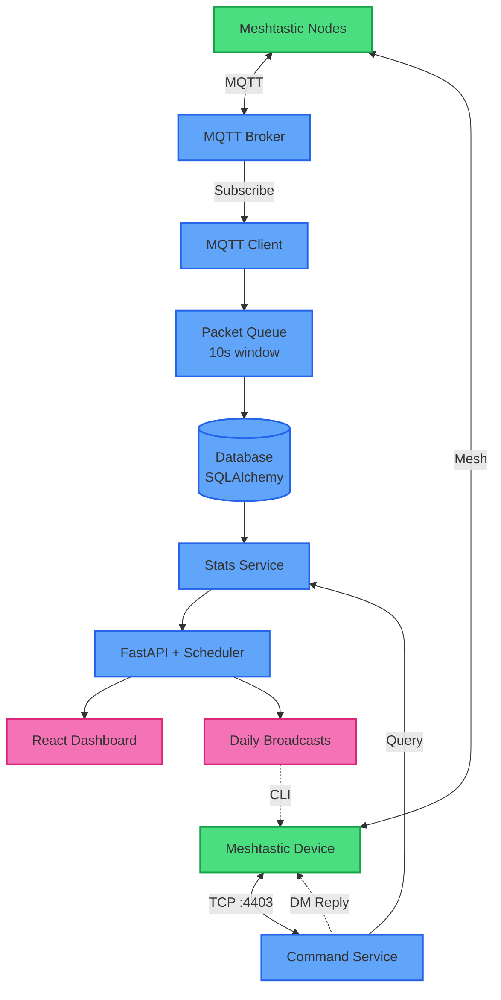

# Meshtastic Statistics Bot

> Collect, analyze, and broadcast Meshtastic mesh insights with a single Python service.

## Table of Contents
- [Overview](#overview)
- [Features](#features)
- [Architecture Overview](#architecture-overview)
- [Tech Stack](#tech-stack)
- [Requirements](#requirements)
- [Installation](#installation)
- [Configuration](#configuration)
- [Running the Application](#running-the-application)
- [API Documentation](#api-documentation)
- [Usage Examples](#usage-examples)
- [Meshtastic Commands](#meshtastic-commands)
- [Development](#development)
- [Architecture Details](#architecture-details)
- [Troubleshooting](#troubleshooting)
- [Contributing](#contributing)
- [License](#license)

## Overview
The Meshtastic Statistics Bot ingests MQTT data from a Meshtastic mesh, aggregates propagation statistics, exposes them via FastAPI endpoints, and distributes daily summaries to subscribed users via Meshtastic. It features a modern React dashboard for visualizing mesh statistics, a command bot for in-mesh queries, and automatic gateway count tracking with late-arrival handling. Intended for production use with scheduler, durable storage, and comprehensive test coverage.

## Features
- **MQTT ingestion**: Connects securely to your broker and decodes protobuf payloads with support for multiple decryption keys.
- **Smart gateway tracking**: 10-second packet grouping window with automatic late-arrival handling for accurate gateway counts.
- **Rich API**: FastAPI endpoints for statistics, subscriptions, rolling window stats (24h/7d/30d), and health checks (Swagger at `/docs`).
- **Modern dashboard**: React + TypeScript web UI with real-time visualizations, percentile charts, and network statistics.
- **Subscription system**: Users opt into daily low/average/high summaries delivered via Meshtastic.
- **Scheduler**: APScheduler runs daily jobs at a configurable time (defaults to 09:00 UTC).
- **In-mesh command bot**: Direct TCP interface to Meshtastic device for real-time DM responses with automatic reconnect.
- **Percentile analytics**: Track p50, p90, p95, p99 gateway distributions across multiple time windows.
- **CLI scripts**: `scripts/*.sh` provide curl helpers for quick manual testing.
- **Privacy-aware**: Respects `bitfield` settings to honor "OK to MQTT" disabled on nodes.
- **Docker-ready**: Comes with Dockerfile & docker-compose for container deployments.

## Architecture Overview

Components:
- **MQTT Client**: Parses protobuf messages, queues them for 10s to collect gateway relays, persists to DB.
- **Packet Queue**: Groups messages by ID, tracks unique gateways, handles late arrivals (>10s after first seen).
- **Command Service**: Listens for `!` commands via TCP connection, sends DM responses with auto-reconnect.
- **FastAPI**: REST endpoints for stats, subscriptions, rolling windows, health checks, and admin functions.
- **Dashboard**: Modern React UI with charts, percentiles, network stats, and time range selectors.
- **Scheduler**: Daily job sends personalized summaries to subscribers via Meshtastic.
- **Services**: Encapsulate business logic (stats aggregation, subscriptions, messaging).

## Tech Stack

### Backend
- Python 3.11+
- FastAPI + Uvicorn
- SQLAlchemy + Alembic
- Pydantic v2
- Paho-MQTT
- APScheduler
- Meshtastic Python library & protobufs
- Docker / docker-compose (optional)

### Frontend
- React 18
- TypeScript
- Vite
- TailwindCSS
- Recharts (visualizations)

## Requirements

### Backend
- Python 3.11+
- pip and virtualenv (recommended)
- Access to a Meshtastic MQTT broker (credentials and root topic)
- Meshtastic device with TCP interface enabled (for command bot) or Meshtastic CLI
- SQLite (default) or change `DATABASE_URL` for Postgres etc.
- Docker (optional for containerized deployments)

### Frontend (optional)
- Node.js 18+ and npm
- Modern web browser

## Installation

### Backend Setup
```bash
git clone https://github.com/your-org/meshtastic-stats-bot.git
cd meshtastic-stats-bot
python3.11 -m venv .venv
source .venv/bin/activate
pip install -r requirements.txt
cp .env.example .env
# edit .env to set MQTT credentials, connection URL, etc.
python -m alembic upgrade head
```

### Dashboard Setup (optional)
```bash
cd dashboard
npm install
npm run build  # for production
# or
npm run dev    # for development with hot reload
```

The built dashboard is served automatically by the FastAPI backend at `http://localhost:8000/`.

## Configuration
All configuration lives in `.env` and is loaded via `python-dotenv`.

### Core Settings
| Variable | Description |
| -------- | ----------- |
| `DATABASE_URL` | SQLAlchemy URL (`sqlite:///meshtastic_stats.db` default) |
| `API_HOST`, `API_PORT`, `API_DEBUG` | FastAPI server settings (default: `0.0.0.0:8000`) |
| `LOG_LEVEL` | Application log level (`INFO`, `DEBUG`, etc.) |

### MQTT Settings
| Variable | Description |
| -------- | ----------- |
| `MQTT_SERVER` | Broker host (e.g., `mqtt.bayme.sh`) |
| `MQTT_USERNAME` / `MQTT_PASSWORD` | Broker credentials |
| `MQTT_ROOT_TOPIC` | Base topic (e.g., `msh/US/bayarea/2/e/LongFast`) |
| `MQTT_TLS_ENABLED` | `true` or `false` to enable TLS |
| `MQTT_TLS_INSECURE` | `true` to allow self-signed certs |
| `MESHTASTIC_DECRYPTION_KEYS` | Comma-separated base64 AES keys for decrypting MQTT packets |
| `MESHTASTIC_INCLUDE_DEFAULT_KEY` | Include default `AQ==` key for public meshes (`true`/`false`) |

### Meshtastic Device Settings
| Variable | Description |
| -------- | ----------- |
| `MESHTASTIC_CONNECTION_URL` | `tcp://192.168.1.10:4403` or `serial:///dev/ttyUSB0` for Python library |
| `MESHTASTIC_CLI_PATH` | Path to `meshtastic` CLI binary (for scheduler broadcasts) |
| `MESHTASTIC_ENV_FILE` | Optional path to override `.env` (e.g., `.env.heltec`) |
| `MESHTASTIC_COMMANDS_ENABLED` | `true` to enable in-mesh command bot |
| `MESHTASTIC_STATS_CHANNEL_ID` | Destination channel index for broadcasts (`0` for primary) |

### Scheduler Settings
| Variable | Description |
| -------- | ----------- |
| `SUBSCRIPTION_SEND_HOUR` | Hour to send daily summaries (UTC, 0-23) |
| `SUBSCRIPTION_SEND_MINUTE` | Minute to send daily summaries (0-59) |

## Running the Application

### Production Mode (all components)
Starts MQTT client, command bot, scheduler, and API server with built dashboard:
```bash
python main.py
```
Access dashboard at: `http://localhost:8000/`  
Access API docs at: `http://localhost:8000/docs`

### Development Mode (backend only)
API server with auto-reload (no MQTT/scheduler):
```bash
python -m uvicorn src.api.main:app --reload
```

### Development Mode (frontend only)
Hot-reload dashboard with Vite dev server:
```bash
cd dashboard
npm run dev
```
Dashboard runs at: `http://localhost:5173/` (proxies API requests to backend)

### Docker Compose
```bash
docker-compose up --build
```

### Docker (manual)
```bash
docker build -t meshtastic-stats-bot .
docker run -it --env-file .env -p 8000:8000 meshtastic-stats-bot
```

## API Documentation
- **Dashboard UI**: http://localhost:8000/ (main web interface)
- **Swagger UI**: http://localhost:8000/docs (interactive API docs)
- **OpenAPI schema**: http://localhost:8000/openapi.json
- **Detailed reference**: See [`docs/API.md`](docs/API.md)

## Usage Examples
### Create a test user
```bash
./scripts/mock_user.sh 101 "Test User" mesh101
```

### Create a mock message
```bash
./scripts/mock_message.sh 101 5 "2025-01-01T12:00:00Z"
```

### Query stats
```bash
curl http://localhost:8000/stats/last
curl http://localhost:8000/stats/today
curl http://localhost:8000/stats/user/101/last/5
```

### Subscribe a user
```bash
curl -X POST http://localhost:8000/subscribe/101/daily_avg
```

### Health check
```bash
curl http://localhost:8000/health
```

### Meshtastic Commands
When `MESHTASTIC_COMMANDS_ENABLED=true`, the bot responds to in-network chat commands:
- `!help`
- `!about`
- `!stats last message`
- `!stats last 5 messages`
- `!stats today`
- `!stats today detailed`
- `!stats status`
- `!subscribe daily_low|daily_avg|daily_high`
- `!unsubscribe`
- `!my_subscriptions`

Script helpers remain available:
- `scripts/subscribe.sh USER_ID TYPE`
- `scripts/list_subscriptions.sh [TYPE]`
- `scripts/stats_last.sh`, `stats_last_n.sh`, `stats_user_last.sh`, etc.

Manual CLI command example (useful for broadcasting):
```bash
meshtastic --sendtext "Hello mesh" --destinationId 1234
```

## Development

### Backend
- Run tests: `pytest`
- Coverage report: `pytest --cov=src --cov-report=term-missing`
- Linting: `flake8 src`
- Formatting: `black src`
- Type checking: `mypy src`

### Frontend
```bash
cd dashboard
npm run dev        # Development server with hot reload
npm run build      # Production build
npm run preview    # Preview production build
npm run lint       # ESLint check
```

## Architecture Details

### Core Components

**MQTT Client & Packet Queue**
- Paho-MQTT parses protobuf messages (`meshtastic.mesh_pb2`)
- 10-second grouping window collects replays from multiple gateways
- Late gateway arrivals (>10s after first seen) are added to existing DB records
- Respects `bitfield` settings to honor "OK to MQTT" disabled nodes

**Command Service**
- TCP connection to Meshtastic device via Python library
- Listens for `!` commands and sends direct message responses
- Automatic reconnection on connection loss or broken pipe errors
- 5-second delay between message chunks to ensure reliable delivery

**Stats Service**
- Aggregates gateway counts with percentile calculations (p50, p90, p95, p99)
- Rolling window statistics: 24 hours, 7 days, 30 days
- Caches computed stats in `statistics_cache` table for performance

**API Layer**
- FastAPI + Pydantic schemas for type safety
- Serves built React dashboard as static files
- REST endpoints for stats, subscriptions, health, and admin functions
- Dependency injection for easy testing

**Scheduler**
- APScheduler with CronTrigger for daily summaries
- Sends personalized stats to subscribers via Meshtastic
- Configurable send time (defaults to 09:00 UTC)

**Dashboard**
- React 18 + TypeScript for type-safe frontend
- TailwindCSS for responsive, modern UI
- Recharts for interactive visualizations
- Time range selectors for network stats and percentiles

### Database Schema
- **users**: Node information, roles, last seen timestamps
- **messages**: Parsed messages with sender, timestamp, gateway counts
- **message_gateways**: Many-to-many relationship tracking which gateways relayed each message
- **subscriptions**: User preferences for daily summaries
- **statistics_cache**: Pre-computed aggregations for performance
- **command_logs**: Audit log of bot commands

See `migrations/` for Alembic migration history.

### Data Flow
1. MQTT message arrives → parsed → added to packet queue
2. After 10 seconds → group persisted with unique gateway count
3. Late gateways → directly added to existing message record
4. API & dashboard query aggregated stats via StatsService
5. Scheduler formats daily summary → sends to each subscriber
6. Command bot receives `!` command → processes → sends DM response

More details in [`docs/ARCHITECTURE.md`](docs/ARCHITECTURE.md).

## Troubleshooting

| Issue | Fix |
|-------|-----|
| MQTT connection fails with SSL error | Set `MQTT_TLS_INSECURE=true` or provide CA cert via `tls_set` |
| Command bot not responding | Check `MESHTASTIC_CONNECTION_URL` is correct (e.g., `tcp://192.168.1.10:4403`). Verify TCP interface is enabled on device. Check logs for `BrokenPipeError` and reconnection attempts. |
| Only receiving first chunk of multi-part responses | Device firmware may have issues with rapid messages. Increase delay in `meshtastic_command_service.py` or update device firmware to 2.5.15+. |
| High CPU with command bot enabled | The Python TCP interface can busy-spin if the CLI binary is missing or unreachable. Install the CLI via `pipx install meshtastic` (Debian PEP 668 friendly), set `MESHTASTIC_CLI_PATH=/root/.local/bin/meshtastic`, and optionally remove `MESHTASTIC_CONNECTION_URL` to force CLI mode. Ensure `/root/.local/bin` is on PATH or set the full CLI path. |
| Gateway counts seem low | Late arrivals (>10s) are now handled automatically. Check logs for "Added late gateway" messages. |
| Meshtastic CLI not found | Install CLI: `pip install meshtastic` and set `MESHTASTIC_CLI_PATH` if needed. |
| Database locked / busy | Ensure only one writer (SQLite limitation). Use Postgres for production. |
| Scheduler doesn't run | Check logs, ensure main entrypoint (`python main.py`) is used, not just API server. |
| API returning 500 | Check logs for stack traces. Ensure all env vars are set and DB is accessible. |
| Dashboard not loading | Ensure dashboard is built: `cd dashboard && npm run build`. Check FastAPI is serving static files from `dashboard/dist/`. |
| MQTT messages not being persisted | Verify `MESHTASTIC_DECRYPTION_KEYS` includes all necessary keys. Check for "bitfield set to 0" messages if nodes have "OK to MQTT" disabled. |

## Contributing
1. Fork + clone repo
2. Create feature branch: `git checkout -b feature/xyz`
3. Make changes, add tests
4. `pytest -v` and `flake8 src`
5. Submit PR with description

## License
MIT License © 2025 Your Name or Organization. See [LICENSE](LICENSE) for details.

