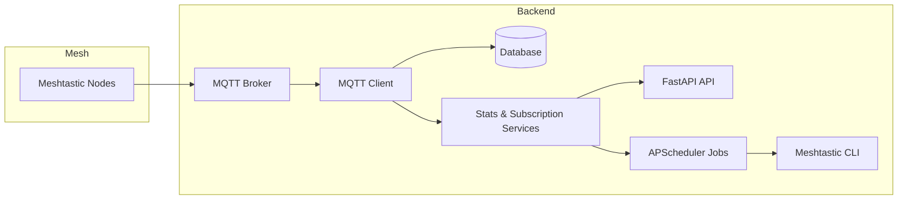

# Architecture

## Overview

## Components
- **MQTT Client**: Paho-MQTT, TLS-capable, parses protobuf payloads via `meshtastic.mesh_pb2`.
- **Database Layer**: SQLAlchemy ORM + Alembic migrations (users, messages, subscriptions, statistics cache).
- **Services**:
  - `StatsService`: aggregation, hourly breakdowns, caching.
  - `SubscriptionService`: user subscription lifecycle, message formatting.
  - `MeshtasticService`: CLI wrapper for sending messages.
- **API Layer**: FastAPI, Pydantic v2 schemas, router with stats/subscription/mock/health endpoints.
- **Scheduler**: APScheduler CronTrigger to run daily jobs at configured hour/minute.
- **Command Listener**: Meshtastic python interface + pubsub to receive in-mesh chat commands and reply with stats/subscription actions.
- **CLI Scripts**: Bash helpers for manual API testing.

## Data Flow
1. **Ingestion**:
   - MQTT client receives protobuf payload → parse → store `Message` + ensure `User`.
2. **Aggregation**:
   - API calls `StatsService` to compute stats on-demand.
   - Scheduler triggers `send_daily_reports()` to get stats + send via Meshtastic CLI.
3. **Delivery**:
   - `MeshtasticService` runs CLI command: `meshtastic --sendtext <msg> --destinationId <node>`.

## Database Schema
- `users`: `id`, `user_id` (mesh), `username`, `mesh_id`, `created_at`, `last_seen`.
- `messages`: message metadata incl. RSSI/SNR, timestamps, payload.
- `subscriptions`: `user_id` (unique), `subscription_type`, `is_active`.
- `statistics_cache`: cached daily/hourly metrics.

## Design Decisions
- SQLite default for simplicity; pluggable via `DATABASE_URL`.
- TLS MQTT with configurable insecure mode for self-signed CAs.
- APScheduler chosen for cron-style scheduling in-process.
- Uvicorn + FastAPI for lightweight REST API + docs.
- Tests rely on in-memory SQLite with `StaticPool` for concurrency.

