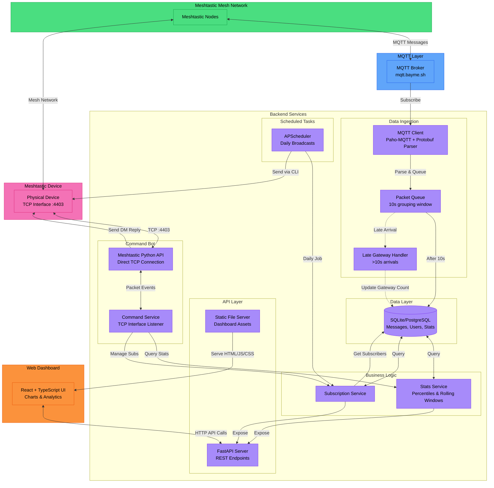

# Architecture

## Overview


## Components

### Data Ingestion Layer
- **MQTT Client** (`src/mqtt/client.py`)
  - Paho-MQTT with TLS support
  - Parses Meshtastic protobuf payloads (`meshtastic.mesh_pb2`)
  - Supports multiple decryption keys
  - Respects `bitfield` settings (honors "OK to MQTT" disabled)
  
- **Packet Queue** (`src/mqtt/packet_queue.py`)
  - Groups messages by packet ID over 10-second window
  - Tracks unique gateway relays per message
  - Deduplicates envelope hashes to prevent double-counting
  - Returns `(added, late_arrival)` tuple for late gateway handling
  
- **Late Gateway Handler** (`src/mqtt/client.py`)
  - Detects gateway relays arriving >10s after first seen
  - Directly updates existing message records in database
  - Logs late arrivals for monitoring

### Business Logic Layer
- **Stats Service** (`src/services/stats_service.py`)
  - Aggregation: daily, hourly, user-specific statistics
  - Percentile calculations (p50, p90, p95, p99)
  - Rolling window stats: 24 hours, 7 days, 30 days
  - Database-agnostic SQL (handles SQLite vs PostgreSQL date functions)
  - Statistics caching for performance
  
- **Subscription Service** (`src/services/subscription_service.py`)
  - User subscription lifecycle (create, update, delete)
  - Message formatting for daily summaries
  - Supports daily_low, daily_avg, daily_high subscription types
  
- **Command Service** (`src/services/meshtastic_command_service.py`)
  - TCP interface listener via Meshtastic Python library
  - Processes `!` commands from mesh network
  - Direct message responses (not channel broadcasts)
  - Automatic reconnection on connection failures
  - 5-second delay between message chunks for reliability
  - Rate limiting (default: 5 commands per 60 seconds)
  - Command logging to database

### API Layer
- **FastAPI Server** (`src/api/routes.py`)
  - REST endpoints for stats, subscriptions, health, admin
  - Pydantic v2 schemas for type safety
  - OpenAPI/Swagger documentation at `/docs`
  - Serves React dashboard as static files
  - Admin endpoints: command service status/restart, database info
  
- **React Dashboard** (`dashboard/`)
  - TypeScript + React 18
  - TailwindCSS for styling
  - Recharts for data visualization
  - Components: Network stats, percentile charts, message browser
  - Time range selectors (24h, 7d, 30d)
  - Real-time updates via API polling

### Task Scheduling
- **APScheduler** (`src/tasks/scheduler.py`)
  - CronTrigger for daily broadcasts (default: 09:00 UTC)
  - Fetches previous day's statistics
  - Sends personalized summaries to subscribers
  - Uses Meshtastic CLI for message delivery

### Database Layer
- **SQLAlchemy ORM** (`src/models.py`)
  - Alembic migrations (`migrations/`)
  - Supports SQLite (dev) and PostgreSQL (production)
  - Tables: `users`, `messages`, `message_gateways`, `subscriptions`, `statistics_cache`, `command_logs`
  
### Utilities
- **CLI Scripts** (`scripts/*.sh`)
  - Bash helpers for manual API testing
  - Quick commands for stats, subscriptions, health checks

## Data Flow

### 1. MQTT Message Ingestion
```
Meshtastic Node → MQTT Broker → MQTT Client
                                      ↓
                                Parse Protobuf
                                      ↓
                            Check bitfield (OK to MQTT)
                                      ↓
                            Add to Packet Queue (10s window)
                                      ↓
                            Group by packet_id, collect unique gateways
                                      ↓
                            After 10s: Persist to Database
                                      ↓
                        Create/Update User, Message, MessageGateways
```

**Late Gateway Handling:**
```
Gateway relay arrives >10s after first seen
                ↓
        Check envelope hash (not duplicate?)
                ↓
        Find existing message in database
                ↓
        Add gateway to message_gateways table
                ↓
        Update message.gateway_count
```

### 2. Command Bot Flow
```
User sends "!stats today" via mesh
                ↓
        Meshtastic Device receives packet
                ↓
        TCP Interface emits packet event
                ↓
        Command Service receives via Python API
                ↓
        Parse command, check rate limits
                ↓
        Query Stats Service
                ↓
        Format response, chunk if >200 chars
                ↓
        Send DM reply via interface.sendText()
                ↓
        5-second delay between chunks
                ↓
        User receives response on device
```

### 3. Dashboard Interaction
```
User opens http://localhost:8000/
                ↓
        FastAPI serves React static files
                ↓
        React app loads, calls API endpoints
                ↓
        GET /stats/today, /stats/rolling, /messages/detailed
                ↓
        Stats Service queries database
                ↓
        Return JSON responses
                ↓
        React renders charts with Recharts
                ↓
        User interacts with time range selectors
                ↓
        Trigger new API calls, update UI
```

### 4. Daily Broadcast Schedule
```
APScheduler CronTrigger fires at 09:00 UTC
                ↓
        Fetch all active subscriptions
                ↓
        Get previous day's statistics from database
                ↓
        For each subscriber:
                ↓
        Format personalized message (low/avg/high)
                ↓
        Call Meshtastic CLI: meshtastic --sendtext "..." --destinationId NODE_ID
                ↓
        Message delivered via Meshtastic device
```

### 5. API Request Flow
```
HTTP Request → FastAPI Router → Dependency Injection (get_db)
                                            ↓
                                    Create SQLAlchemy Session
                                            ↓
                                    Call Repository/Service
                                            ↓
                                    Query Database
                                            ↓
                                    Transform to Pydantic Model
                                            ↓
                                    Return JSON Response
```

## Database Schema

### Tables

**users**
- `id` (PK): Auto-increment primary key
- `user_id` (unique): Meshtastic node ID (integer)
- `username`: Display name from node info
- `mesh_id`: Mesh identifier (optional)
- `role`: Node role (client, router, router_client, etc.)
- `created_at`: First seen timestamp
- `last_seen`: Most recent activity timestamp

**messages**
- `id` (PK): Auto-increment primary key
- `message_id` (unique): Meshtastic packet ID
- `sender_id` (FK → users): Who sent the message
- `sender_name`: Cached sender display name
- `timestamp`: When message was sent (UTC)
- `gateway_count`: Number of unique gateways that relayed this message
- `rssi`: Signal strength (dBm)
- `snr`: Signal-to-noise ratio
- `payload`: Message text content
- `created_at`, `updated_at`: Audit timestamps

**message_gateways** (many-to-many relationship)
- `id` (PK): Auto-increment primary key
- `message_id` (FK → messages): Which message
- `gateway_id`: Meshtastic gateway node ID (string like "!abc123")
- `created_at`: When relay was recorded
- Unique constraint on (message_id, gateway_id)

**subscriptions**
- `id` (PK): Auto-increment primary key
- `user_id` (FK → users, unique): Who is subscribed
- `subscription_type`: daily_low | daily_avg | daily_high
- `is_active`: Boolean flag
- `created_at`, `updated_at`: Audit timestamps

**statistics_cache**
- `id` (PK): Auto-increment primary key
- `cache_key` (unique): Identifier for cached metric (e.g., "daily_2025-12-03")
- `cache_value`: JSON blob with computed statistics
- `created_at`, `expires_at`: Cache lifecycle timestamps

**command_logs**
- `id` (PK): Auto-increment primary key
- `user_id` (FK → users): Who sent the command
- `command`: Raw command text
- `response`: Bot's response
- `timestamp`: When command was processed
- `success`: Boolean indicating if command succeeded

### Relationships
```
users (1) ←→ (many) messages [sender]
users (1) ←→ (0..1) subscriptions
users (1) ←→ (many) command_logs
messages (1) ←→ (many) message_gateways
```

### Indexes
- `users.user_id` (unique)
- `messages.message_id` (unique)
- `messages.sender_id` (foreign key)
- `messages.timestamp` (for time-range queries)
- `message_gateways.(message_id, gateway_id)` (composite unique)

## Design Decisions

### Database
- **SQLite default** for simplicity and zero-config deployments
- **PostgreSQL-ready** via SQLAlchemy abstraction (production recommendation)
- **Database-agnostic SQL**: Uses dialect detection for date functions
- **Connection pooling**: QueuePool with size 10, max overflow 20
- **SQLite thread-safety**: `check_same_thread=False` for multi-threaded access

### MQTT Ingestion
- **10-second grouping window**: Balances accuracy vs. latency for gateway counting
- **Late arrival handling**: Gateway relays >10s after initial message are still counted
- **Envelope deduplication**: SHA256 hashing prevents duplicate processing
- **Privacy compliance**: Respects `bitfield` settings to honor "OK to MQTT" disabled
- **Multi-key decryption**: Supports comma-separated AES keys for multiple channels

### Command Bot
- **TCP interface over serial**: More reliable for headless/remote deployments
- **Automatic reconnection**: Handles `BrokenPipeError` and network interruptions
- **Direct messages only**: Commands get DM replies, not channel broadcasts
- **5-second chunk delay**: Prevents firmware issues with rapid message delivery
- **Rate limiting**: Default 5 commands per 60 seconds per user
- **Audit logging**: All commands logged to database

### API Design
- **FastAPI**: Type-safe endpoints with automatic OpenAPI documentation
- **Pydantic v2**: Request/response validation and serialization
- **Static file serving**: Dashboard served from `/` for single-deployment simplicity
- **Health checks**: Multiple endpoints for monitoring different subsystems
- **Admin endpoints**: Runtime introspection and control (command service restart)

### Frontend Architecture
- **React + TypeScript**: Type-safe component development
- **Vite**: Fast development builds with hot module replacement
- **TailwindCSS**: Utility-first styling for rapid UI development
- **Recharts**: D3-based charting with React-friendly API
- **Build-time integration**: Dashboard built into `dist/` and served by FastAPI

### Scheduling
- **APScheduler in-process**: Simpler than external job queues for single-deployment
- **CronTrigger**: Precise daily broadcast timing (default 09:00 UTC)
- **Meshtastic CLI for broadcasts**: Separate from command bot for reliability

### Testing Strategy
- **In-memory SQLite**: Fast test execution with `StaticPool` for concurrency
- **Repository pattern**: Business logic isolated from API layer for testability
- **Mock data endpoints**: Testing helpers in production API (can be disabled)
- **Dependency injection**: FastAPI's DI system enables easy test overrides

### Performance Optimizations
- **Statistics caching**: Pre-computed metrics stored in `statistics_cache` table
- **Rolling window caching**: 24h/7d/30d stats cached to avoid repeated calculations
- **Percentile calculations**: Single-pass algorithms for p50/p90/p95/p99
- **Indexed queries**: Strategic indexes on foreign keys and timestamp columns

